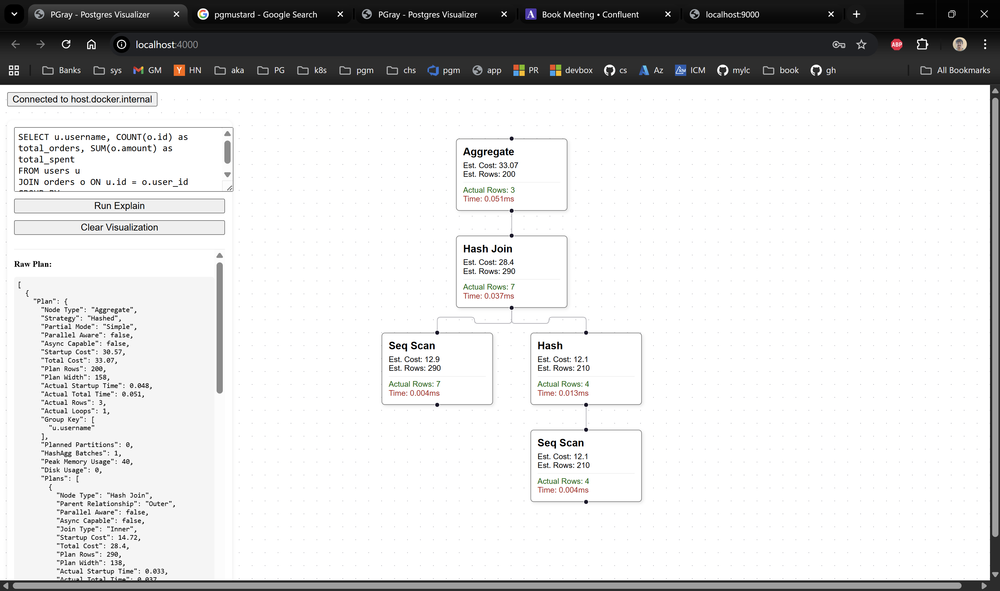

# pgRay - Postgres Query Visualizer

pgRay is a full-stack application that visualizes PostgreSQL `EXPLAIN ANALYZE` plans in a tree-like structure, similar to tools like pgMustard. It allows developers to quickly investigate query performance issues by exploring the execution plan visually.

## Features

*   **Connect to Local Database**: Securely connects to your local Postgres instance via Docker.
*   **Three-Pane Layout**: 
    *   **Left**: Persistent SQL editor to tweak queries without losing context.
    *   **Center**: Interactive node-link diagram using React Flow.
    *   **Right**: Sliding details panel for deep-diving into specific node metrics.
*   **Run Explain Plans**: Type raw SQL and execute `EXPLAIN (FORMAT JSON, ANALYZE)` instantly.
*   **Visual Tree**: Interactive visualization of the execution plan using Dagre layout.
*   **Detailed Analytics**: Click any node to see detailed stats (Actual Rows, Loops, Filter Rows Removed).
*   **Total Time**: Instant visibility into the total execution time of your query.
*   **Query History**: Every executed query is stored locally (SQLite) and accessible via **History**.
*   **Heatmap Bottleneck Highlighting**:
    *   Highlights bottlenecks using **Exclusive Time** (node time minus immediate children).
    *   Heatmap shading from green → yellow → red, with the hottest node emphasized.
    *   Always enabled.

## Screenshot

Screenshot of pgRay showing the three-pane layout and heatmap bottleneck highlighting.



## Architecture

*   **Frontend**: React, Vite, React Flow, Axios, Dagre
*   **Backend**: Python FastAPI, Pydantic, Psycopg2
*   **Database**: Connects to user-provided Postgres instance
*   **Infrastructure**: Docker Compose (services linked via `host.docker.internal`)

## Query History (Local)

pgRay stores executed queries in a local SQLite database inside the backend container.

*   Persistence: query history is stored in a Docker volume mounted at `/data` (so it survives restarts).
*   Editor Prefill: on load, the SQL editor is pre-filled with the most recent saved query.

## Getting Started

### Prerequisites

*   Docker and Docker Compose
*   A local PostgreSQL database

### Installation & Run

1.  Clone the repository:
    ```bash
    git clone https://github.com/your-username/pgray.git
    cd pgray
    ```

2.  Start the application:
    ```bash
    docker-compose up --build
    ```

3.  Access the App:
    *   **Frontend**: [http://localhost:4000](http://localhost:4000)
    *   **Backend API**: [http://localhost:9000/docs](http://localhost:9000/docs)

### Connecting to Localhost Postgres

Since the app runs in Docker, use the host `host.docker.internal` to refer to your local machine's Postgres.

**Important**: You may need to configure your `pg_hba.conf` to allow connections from the Docker subnet (e.g., `172.16.0.0/12`).

```conf
# /etc/postgresql/<version>/main/pg_hba.conf
host    all             all             172.16.0.0/12           scram-sha-256
```

## License

[Apache 2.0](LICENSE)
