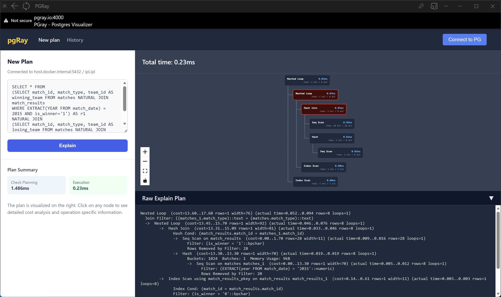

# pgRay - Postgres Query Visualizer

pgRay is a full-stack application that visualizes PostgreSQL `EXPLAIN ANALYZE` plans in a tree-like structure. It allows developers to quickly investigate query performance issues by exploring the execution plan visually.

## Features

*   **Connect to Local Database**: Securely connects to your local Postgres instance via Docker.
*   **Three-Pane Layout**: 
    *   **Left**: Collapsible Query Editor with options for Analysis and Result Fetching.
    *   **Center**: Interactive node-link diagram using React Flow.
    *   **Right**: Sliding details panel for deep-diving into specific node metrics.
*   **Floating SQL Panel**: Draggable panel showing formatted query. Now features **Smart Positioning**: automatically aligns with the top plan node and intelligently positions itself in available space to avoid obscuring the graph. Hidden when viewing results.
*   **Smart Highlighting**: Intelligent logic to highlight `WHERE` clauses for Scans (extracting filter columns), `ORDER BY` for Sorts, and `LIMIT` clauses.
*   **Buffering Detector**: Automatically detects and warns about low cache hit ratios (< 99%), helping you identify queries that are reading heavily from disk.
*   **Dual Input Modes**: Sidebar now supports:
    *   **SQL Query**: Standard mode for executing queries.
    *   **Paste JSON**: Direct input for visualizing raw JSON execution plans without backend execution.
*   **Persistent Connection**: Connection settings are saved and auto-connected on reload.
*   **Professional Dark Mode**: Full dark theme for Sidebar, Modals, and Panels.
*   **Analysis Options**: 
    *   **Analyze**: Toggle `EXPLAIN ANALYZE` (enabled by default) for actual execution times.
    *   **Get Results**: Optionally fetch actual query results (limited to 100 rows) alongside the plan.
*   **Run Explain Plans**: Type raw SQL and execute instantly.
*   **Visual Tree**: Indented outline tree layout.
*   **Explorer-Style Connectors**: Vertical spines only where a node has multiple children, with short horizontal taps into each node.
*   **Node Stats**: Immediate visibility of key metrics directly on each node:
    *   **Node ID**: Easy reference for large plans.
    *   **Rows**: Estimated vs Actual rows.
    *   **Discarded Rows**: Rows removed by filters are highlighted in red.
    *   **Relation Names**: Tables/Aliases are clearly displayed.
*   **Detailed Analytics**: Click any node to see more stats (Loops, Filter Rows Removed, Buffer Usage).
*   **Total Time**: Instant visibility into the total execution time of your query.
*   **Tabbed Results Interface**: Switch seamlessly between the visual Explain Plan and the actual Query Results grid.
*   **Raw JSON Plan Panel**: Integrated "Raw JSON" tab in the details panel to review the source data.
*   **Query History**: Every executed query is stored locally (SQLite) and accessible via **History**.
*   **AI SQL Assistant**:
    *   **Text-to-SQL**: Generate SQL queries from natural language questions using a local LLM (Ollama).
    *   **Direct Streaming**: generated SQL streams **directly** into the editor in real-time.
    *   **Visual Feedback**:
        *   **Progress Bar**: Visual indicator during AI generation.
        *   **Checkmark Status**: Simple green checkmark verifies updates (avoiding chat clutter).
    *   **Auto-Restore Session**: Chat history and SQL drafts are automatically saved and restored on reload.
    *   **Diff View**: Dedicated toggleable Diff View to compare the AI's changes against your previous query side-by-side.
    *   **Self-Explanatory**: AI adds inline comments (`-- explanation`) to complex query logic.
    *   **Smart Explanation**: dedicated "Explain" button provides a natural language breakdown of complex queries in a side-by-side view.
*   **Resizable Interface**:
    *   **Query Results**: Draggable results pane with maximize/restore capability.
    *   **Explanation Pane**: Collapsible and resizable (via flex) split-pane for AI explanations.
*   **Heatmap Bottleneck Highlighting**:
    *   Highlights bottlenecks using **Exclusive Time** (node time minus immediate children).
    *   Heatmap shading from green → yellow → red, with the hottest node emphasized.
    *   Always enabled.

## Screenshot

Screenshot of pgRay showing the three-pane layout and heatmap bottleneck highlighting.



## Architecture

*   **Frontend**: React, Vite, React Flow, Axios
*   **Backend**: Python FastAPI, Pydantic, Psycopg2
*   **Database**: Connects to user-provided Postgres instance
*   **Infrastructure**: Docker Compose (services linked via `host.docker.internal`)

## Query History (Local)

pgRay stores executed queries in a local SQLite database inside the backend container.

*   Persistence: query history is stored in a Docker volume mounted at `/data` (so it survives restarts).
*   Editor Prefill: on load, the SQL editor is pre-filled with the most recent saved query.

## Getting Started

### Prerequisites

*   Docker and Docker Compose
*   A local PostgreSQL database

### Installation & Run

1.  Clone the repository:
    ```bash
    git clone https://github.com/your-username/pgray.git
    cd pgray
    ```

2.  Start the application:
    ```bash
    docker-compose up --build
    ```

3.  Access the App:
    *   **Frontend**: [http://localhost:4000](http://localhost:4000)
    *   **Backend API**: [http://localhost:9000/docs](http://localhost:9000/docs)

### Connecting to Localhost Postgres

Since the app runs in Docker, use the host `host.docker.internal` to refer to your local machine's Postgres.

**Important**: You may need to configure your `pg_hba.conf` to allow connections from the Docker subnet (e.g., `172.16.0.0/12`).

```conf
# /etc/postgresql/<version>/main/pg_hba.conf
host    all             all             172.16.0.0/12           scram-sha-256
```

## License

[Apache 2.0](LICENSE)
