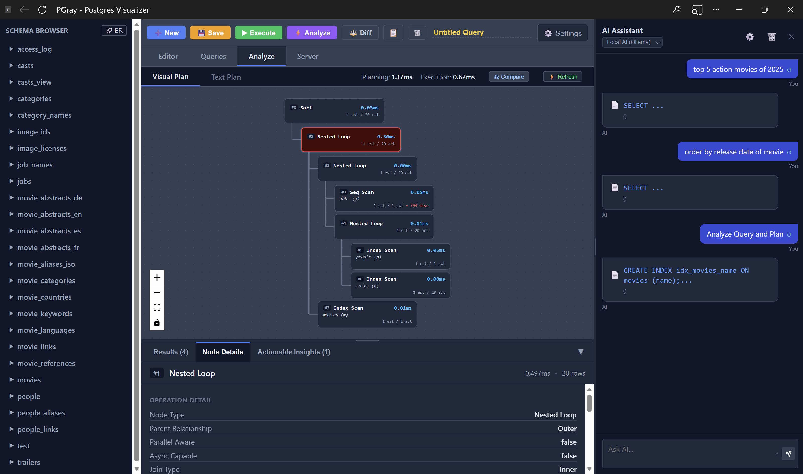
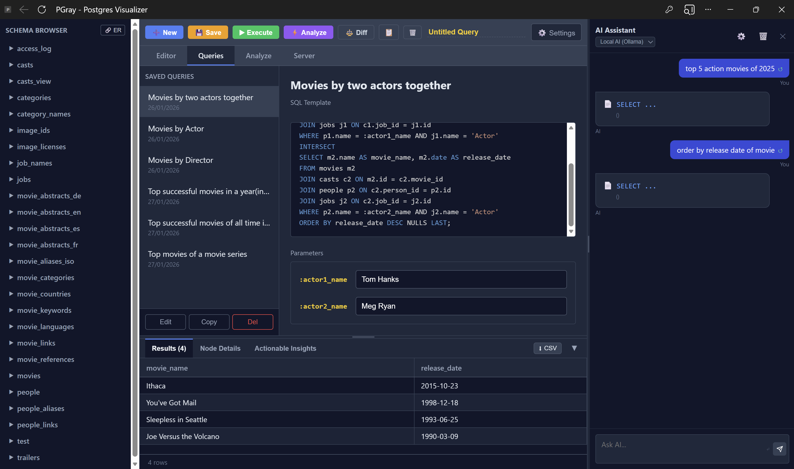
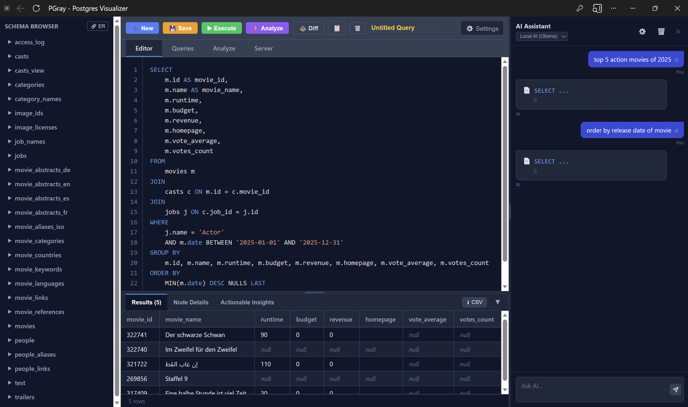
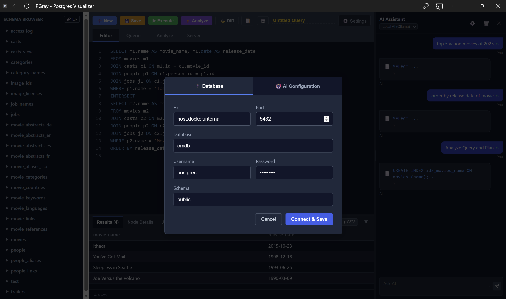
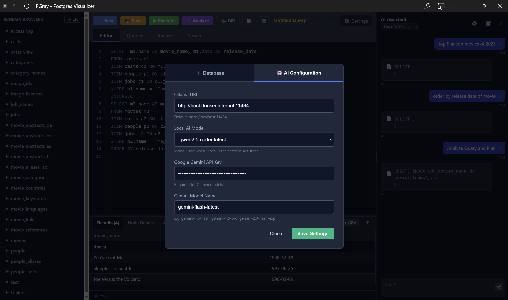

# pgRay - Postgres Query Visualizer

pgRay is a full-stack application that visualizes PostgreSQL `EXPLAIN ANALYZE` plans using an interactive node-link diagram. It combines modern visualization with AI-powered insights to help developers optimize query performance.



## Features

*   **Interactive Visualization**:
    *   **Node-Link Diagram**: Visualize complicated execution plans using React Flow.
    *   **Smart Layout**: Hierarchical tree layout with explorer-style connectors.
    *   **Node Metrics**: Instant visibility of Rows (Est/Act), Time, and Loops directly on the node.
    *   **Context Menu**: Right-click any node to **Analyze** it with AI or view details.
    *   **Auto-Fit**: Automatically centers and zooms the graph for the best view.
    *   **ER Diagram**: Interactive Entity-Relationship diagram with **drag-and-drop** layout and **persistent saving**.
    *   **Adaptive Layout Engine**: Smart Auto/Flow/Star layout modes using dagre—Northwind gets hierarchical, OMDB gets radial.
    *   **Click-to-Expand**: Click any table to expand all columns—layout automatically adjusts to fit.
    *   **Toggle Details**: Global expand/collapse for all table columns (📋 Details → 🔑 Keys Only → 🔄 Auto).

*   **Local-First AI Assistant**:
    *   **Context-Aware**: Understands your database schema and query history.
    *   **Text-to-SQL**: Generate complex SQL from natural language questions.
    *   **Real-Time Streaming**: Watch the SQL appear in your editor character-by-character as the AI types it.
    *   **Auto-Explain Loop**: Automatically runs `EXPLAIN ANALYZE` on generated queries to fetch real performance metrics immediately.
    *   **Compact Chat UI**: SQL previews are unobtrusive text links; timings are displayed as `(P: 8ms, E: 78ms)`.
    *   **Interactive Analysis**: Ask "Analyze Node" to get deep optimization advice.
    *   **Actionable Insights**: AI automatically suggests SQL fixes (e.g., `CREATE INDEX`) which are extracted into a dedicated "Insights" tab.
    *   **Granular Execution**: Execute suggested optimizations individually with instant success/failure feedback via toast notifications.
    *   **Performance Comparison**: Measure impact with a "Compare" tool that shows optimization gains (e.g., "Planning: -10ms") against your original baseline.
    *   **Dual Engine Support**: Switch seamlessly between **Local AI** (Ollama) for privacy and **Google Gemini** for enhanced reasoning.
    *   **Smart Warmup**: "Warmup-on-Type" ensures models are loaded and ready before you even hit send, minimizing latency.
    *   **Performance Metrics**: Real-time "Time to First Token" (TTFT) tracking to monitor AI responsiveness.

*   **Flexible Workspace**:
    *   **Verb-Based Architecture**: Streamlined navigation with **Ask**, **Query**, **Design**, and **Admin** tabs.
    *   **Dual Query Modes**: Toggle between **Code** (Editor + Results) and **Plan** (Full-Screen Visual + Auto-Explain) modes.
    *   **Design Studio**: Integrated Schema Browser and Interactive ER Diagram in a unified view.
    *   **Admin Dashboard**: Centralized server configuration and health monitoring.
    *   **Resizable Panes**: Customize the width of the AI Assistant sidebar.
    *   **Database Selector**: Toolbar shows current database with quick-switch dropdown.

*   **Session Management**:
    *   **Explicit Save**: Sessions start as scratchpads. Saving them permanently stores the query.
    *   **Auto-Naming**: AI automatically generates descriptive titles (e.g., "Movies by Actor") upon saving.
    *   **Parameterized Storage**: Saved queries are automatically parameterized (e.g., `WHERE name = :name` or `LIMIT :limit_val`) for reuse.
    *   **History**: Access previously saved sessions and resume work instantly.
    *   **Queries Tab**: Dedicated tab to explore, fill parameters (e.g., `:actor_name`), and Execute saved queries seamlessly.
    *   **Visual Query Management**: Edit, Duplicate, or Delete saved queries directly from a **dedicated sidebar** with Context Menu support.
    *   **Context Menu**: Right-click saved queries to **Rename**, **Duplicate**, or **Delete** them instantly.
    *   **Enhanced Layout**: SQL Editor maximizes to fill the screen ("flex-grow") with long-line wrapping, while keeping controls pinned to the footer.
    *   **Searchable Dropdowns**: Parameters with table/column metadata show a searchable dropdown that filters potential values from the database in real-time.
    *   **Fast Save**: Intelligent title skipping and robust regex parameter detection ensure saving is instant and accurate, even for complex queries.
    *   **Settings Management**: Centralized configuration modal (Gear Icon) to manage Database Connections, AI Providers (Ollama/Gemini), and specific Model versions (e.g., `gemini-1.5-flash`).
    *   **Clean Startup**: Application always launches in a pristine state ("New Query") to prevent context clutter.

*   **Deep Analytics**:
    *   **Results Tab**: View actual query result rows immediately.
    *   **CSV Export**: One-click download of query results to CSV for external analysis.
    *   **Node Details**: Drill down into specific operators to see Filters, Buffer Usage, and Output columns.
    *   **Diff View**: Compare the AI's suggested query changes against your original code side-by-side.

*   **Smart SQL Editor**:
    *   **Auto-Completion**: Context-aware suggestions as you type.
    *   **Smart @ Autocomplete**: Type `@` to instantly search tables and data entities (e.g., `@Brad` -> `Brad Pitt (ID: 287)`).
    *   **Dot Trigger**: Type `table.` or `alias.` to see column suggestions with data types.
    *   **Keyword Trigger**: Type `FROM ` or `JOIN ` to see available table names.
    *   **Keyboard Navigation**: Use Arrow keys to navigate, Enter/Tab to select, Escape to dismiss.
    *   **Visual Badges**: Distinct badges (TBL/COL) help identify suggestion types at a glance.
    *   **Inline AI Diff**: Automatically highlights lines changed by the AI assistant directly in the editor, making it easy to spot modifications.
    *   **Integrated Parameters**: "Query Parameters" panel lives within the Results pane for a seamless Edit -> Run -> Tune workflow.

*   **Clean Search ("Zen Mode")**:
    *   **Distraction-Free**: Sidebars automatically hide when searching to give you a full-width canvas.
    *   **Smart Dropdown**: "Google-style" search hub shows **Recent Searches** (session-based) and **Saved Queries** instant access.
    *   **Starter Chips**: One-click discovery chips (e.g., "Top 5 Products") help you explore the dataset immediately.
    *   **Chain-of-Thought AI**: The AI now uses a "Reasoning First" strategy (Subject -> Metrics -> SQL) to ensure high accuracy and avoid lazy aggregations.

*   **Production Safety**:
    *   **Schema-Only Indexing**: Search engine scans only `information_schema` metadata—never touches your actual table data.
    *   **Telemetry Envelope**: APIs return execution metrics (`duration_ms`, `row_count`) alongside results for performance visibility.
    *   **Performance Badge**: Visual ⚡/⚠️/🐢 indicator shows query speed (Green < 200ms, Yellow < 1s, Red > 1s) in both Search and Editor results.
    *   **Performance Drawer**: Click the badge to reveal a slide-over panel showing the SQL, execution time, and a "Tune & Fix" button for deeper analysis.
    *   **Graceful Timeouts**: Extended timeouts (90s) accommodate complex AI-generated queries without premature failures.

    
## Visual Tour

### 1. Interactive Analysis & Insights

The core of pgRay is the **Interactive Node-Link Diagram**. 
- **Time Analysis**: Nodes are color-coded by execution time (Red = Slow).
- **Deep Metrics**: See Row Estimates vs Actuals, Buffer Usage, and Filter effectiveness at a glance.
- **AI Sidebar**: The **Actionable Insights** panel (bottom) lists concrete optimization steps (e.g., `CREATE INDEX`) extracted by AI.

### 2. Saved Queries & Parameter Management

Stop rewriting the same complex JOINs.
- **Database-Specific Storage**: Queries are saved per-connection and per-database, ensuring your development and production queries never mix.
- **Parameterization**: pgRay automatically detects variables (e.g., `:director_name`) and generates input forms for them.
- **Smart Search**: Parameters linked to columns (via AI metadata) offer **Autocomplete Dropdowns** that search your actual database values.
- **Organization**: Rename, Duplicate, or Delete queries with right-click context menus.

### 3. Clean Workspace & AI Chat

Start fresh with a focused environment.
- **Dual AI Engine**: Choose between **Local AI (Ollama)** for privacy or **Google Gemini** for cloud-powered reasoning.
- **Natural Language SQL**: Ask "Top 5 movies by revenue" -> See immediate SQL preview in a split-view layout with auto-explanation.
- **Instant Feedback**: Execute queries immediately and see results in the grid view.

### 4. Centralized Configuration


Manage everything from one place.
- **Connection Manager**: Easily switch between databases or update credentials.
- **AI Models**: Toggle between **Ollama (Local)** and **Gemini (Cloud)**, configure API keys, and set specific model versions (e.g., `gemini-1.5-flash`).

## Architecture

*   **Frontend**: React, Vite, React Flow
*   **Backend**: Python FastAPI, Pydantic, Psycopg2, Ollama (AI)
*   **Database**: Connects to any accessible Postgres instance

## Getting Started

### Prerequisites

*   Docker and Docker Compose
*   A local PostgreSQL database
*   [Ollama](https://ollama.ai/) running locally (for Local AI mode)
*   (Optional) Google AI Studio API Key (for Cloud AI mode)

### Installation & Run

1.  Clone the repository:
    ```bash
    git clone https://github.com/your-username/pgray.git
    cd pgray
    ```

2.  Start the application:
    ```bash
    docker-compose up --build
    ```

3.  Access the App:
    *   **Frontend**: [http://localhost:3000](http://localhost:3000)
    *   **Backend API**: [http://localhost:9000/docs](http://localhost:9000/docs)

### Connecting to Database

Create a `connection.json` file in the `backend/` directory to auto-fill your credentials:

```json
{
  "host": "host.docker.internal",
  "port": "5433",
  "user": "postgres",
  "password": "password",
  "database": "northwind"
}
```


> **Note**: A sample **Northwind** database is automatically bundled. 
> *   **From the App**: Use host `postgres` and port `5432`.
> *   **From Host (DBeaver/pgAdmin)**: Use host `localhost` and port `5433`.
> Use credentials: `postgres` / `password`.

## License

[Apache 2.0](LICENSE)
